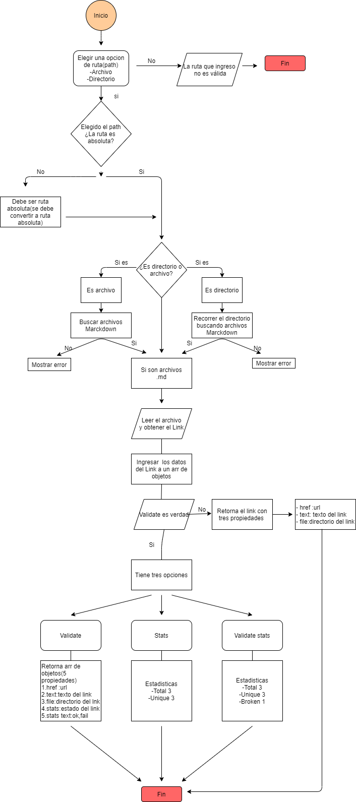
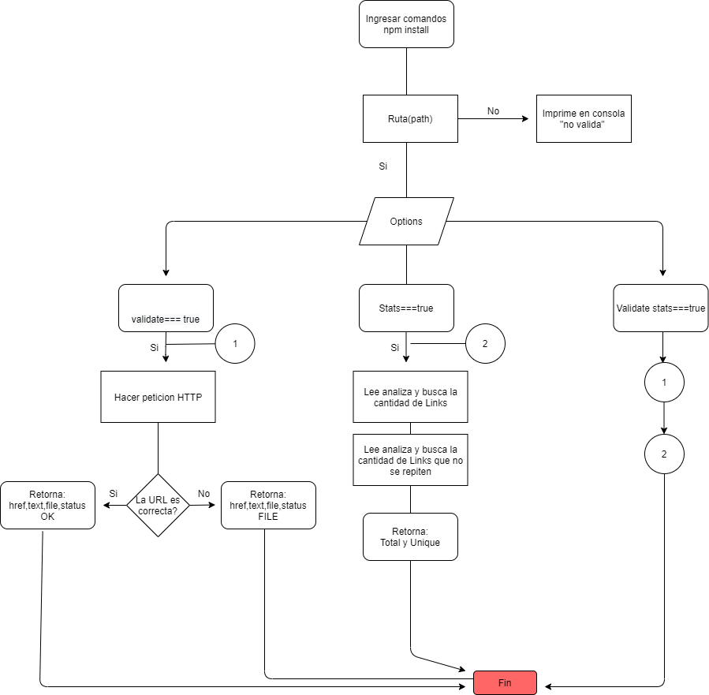

# Markdown Links 📄🔗


## About md-Links

Our options:

- Validate Links(OK, FAIL)
- Stats Links(total, unique, broken)


## Flow Chart 

-Our diagram simplifies us to understand with ease the complexity of the process that we will carry out to build our library.
   - Flow Charts.
   - Git hub projects.

### Flow Chart API 




###  Flow Chart CLI





## How to install mdLinks?

- Install this library with this command: `npm install giovandyyg-md-links `

### API `mdLinks(path, opts)`

#### Example of how to use it:

```js
const mdLinks = require("md-links");

mdLinks("./some/example.md")
  .then(links => {
    // => [{ href, text, file }]
  })
  .catch(console.error);

mdLinks("./some/example.md", { validate: true })
  .then(links => {
    // => [{ href, text, file, status, ok }]
  })
  .catch(console.error);

mdLinks("./some/dir")
  .then(links => {
    // => [{ href, text, file }]
  })
  .catch(console.error);
```

### CLI (Command Line Interface - Interfaz de Línea de Comando)

```js

Remember that to use this library you need to insert:

👉 md-links <path-to-file> [valid arguments]
*****************Valid Arguments*****************
⭐md-links <path-to-file> --validate   --stats
⭐md-links <path-to-file> --stats      --validate
⭐md-links <path-to-file> -v   -s
⭐md-links <path-to-file> -s   -v
⭐md-links <path-to-file> --validate  -v
⭐md-links <path-to-file> --stats     -s
************************************************* 

```

---

### Learning goals
- [⭐] Entender la diferencia entre expression y statements.
- [⭐] Entender el uso de bucles (for | forEach).
- [⭐] Manipular arrays (filter | map | sort | reduce).
- [⭐] Entender la diferencia entre tipos de datos atómicos y estructurados.
- [⭐] Utilizar linter para seguir buenas prácticas (ESLINT)

### Javascript
- [⭐] Uso de callbacks
- [⭐] Consumo de Promesas
- [⭐] Creacion de Promesas
- [⭐] Modulos de Js
- [⭐] Recursión

### Node
- [⭐] Sistema de archivos
- [⭐] package.json
- [⭐] crear modules
- [⭐] Instalar y usar modules
- [⭐] npm scripts
- [⭐] CLI (Command Line Interface - Interfaz de Línea de Comando)

### Testing
- [⭐] Testeo de tus funciones
- [⭐] Testeo asíncrono
- [⭐] Uso de librerias de Mock
- [⭐] Mocks manuales
- [⭐] Testeo para multiples Sistemas Operativos

### Git y Github
* [⭐] Uso de comandos de git (add | commit | pull | status | push)
* [⭐] Manejo de repositorios de GitHub (clone | fork | gh-pages)
* ⭐ Colaboración en Github (branches | pull requests | |tags)
* [⭐] Organización en Github (projects | issues | labels | milestones)

### Buenas prácticas de desarrollo
- [⭐] Modularización
- [⭐] Nomenclatura / Semántica

***

## Pistas / Tips


#### Instalacion desde GitHub

Para que el módulo sea instalable desde GitHub solo tiene que:

- Estar en un repo público de GitHub
- Contener un `package.json` válido

Con el comando `npm install githubname/reponame` podemos instalar directamente
desde GitHub. Ver [docs oficiales de `npm install` acá](https://docs.npmjs.com/cli/install).

Por ejemplo, el [`course-parser`](https://github.com/Laboratoria/course-parser)
que usamos para la currícula no está publicado en el registro público de NPM,
así que lo instalamos directamente desde GitHub con el comando `npm install
Laboratoria/course-parser`.

### Implementación

La implementación de este proyecto tiene varias partes: leer del sistema de
archivos, recibir argumentos a través de la línea de comando, analizar texto,
hacer consultas HTTP, ... y todas estas cosas pueden enfocarse de muchas formas,
tanto usando librerías como implementando en Vanilla JS.

Por poner un ejemplo, el _parseado_ (análisis) del markdown para extraer los
links podría plantearse de las siguientes maneras (todas válidas):

- Usando un _módulo_ como [markdown-it](https://github.com/markdown-it/markdown-it),
  que nos devuelve un arreglo de _tokens_ que podemos recorrer para identificar
  los links.
- Siguiendo otro camino completamente, podríamos usar
  [expresiones regulares (`RegExp`)](https://developer.mozilla.org/es/docs/Web/JavaScript/Guide/Regular_Expressions).
- También podríamos usar una combinación de varios _módulos_ (podría ser válido
  transformar el markdown a HTML usando algo como [marked](https://github.com/markedjs/marked)
  y de ahí extraer los link con una librería de DOM como [JSDOM](https://github.com/jsdom/jsdom)
  o [Cheerio](https://github.com/cheeriojs/cheerio) entre otras).
- Usando un _custom renderer_ de [marked](https://github.com/markedjs/marked)
  (`new marked.Renderer()`).


### Recursos necesarios

- [Acerca de Node.js - Documentación oficial](https://nodejs.org/es/about/)
- [Node.js file system - Documentación oficial](https://nodejs.org/api/fs.html)
- [Node.js http.get - Documentación oficial](https://nodejs.org/api/http.html#http_http_get_options_callback)
- [Node.js - Wikipedia](https://es.wikipedia.org/wiki/Node.js)
- [What exactly is Node.js? - freeCodeCamp](https://medium.freecodecamp.org/what-exactly-is-node-js-ae36e97449f5)
- [¿Qué es Node.js y para qué sirve? - drauta.com](https://www.drauta.com/que-es-nodejs-y-para-que-sirve)
- [¿Qué es Nodejs? Javascript en el Servidor - Fazt en YouTube](https://www.youtube.com/watch?v=WgSc1nv_4Gw)
- [¿Simplemente qué es Node.js? - IBM Developer Works, 2011](https://www.ibm.com/developerworks/ssa/opensource/library/os-nodejs/index.html)
- [Node.js y npm](https://www.genbeta.com/desarrollo/node-js-y-npm)
- [Módulos, librerías, paquetes, frameworks... ¿cuál es la diferencia?](http://community.laboratoria.la/t/modulos-librerias-paquetes-frameworks-cual-es-la-diferencia/175)
- [Asíncronía en js](https://carlosazaustre.com/manejando-la-asincronia-en-javascript/)
- [NPM](https://docs.npmjs.com/getting-started/what-is-npm)
- [Publicar packpage](https://docs.npmjs.com/getting-started/publishing-npm-packages)
- [Crear módulos en Node.js](https://docs.npmjs.com/getting-started/publishing-npm-packages)
- [Leer un archivo](https://nodejs.org/api/fs.html#fs_fs_readfile_path_options_callback)
- [Leer un directorio](https://nodejs.org/api/fs.html#fs_fs_readdir_path_options_callback)
- [Path](https://nodejs.org/api/path.html)
- [Linea de comando CLI](https://medium.com/netscape/a-guide-to-create-a-nodejs-command-line-package-c2166ad0452e)
- [Promise](https://javascript.info/promise-basics)
- [Comprendiendo Promesas en Js](https://hackernoon.com/understanding-promises-in-javascript-13d99df067c1)
- [Pill de recursión - video](https://www.youtube.com/watch?v=lPPgY3HLlhQ&t=916s)
- [Pill de recursión - repositorio](https://github.com/merunga/pildora-recursion)
- [learnyounode](https://github.com/workshopper/learnyounode)
- [how-to-npm](https://github.com/workshopper/how-to-npm)
- [promise-it-wont-hurt](https://github.com/stevekane/promise-it-wont-hurt)


### JavaScript

* [ ] Uso de condicionales (if-else | switch | operador ternario)
* [ ] Uso de funciones (parámetros | argumentos | valor de retorno)
* [ ] Manipular arrays (filter | map | sort | reduce)
* [ ] Manipular objects (key | value)
* [ ] Uso ES modules ([`import`](https://developer.mozilla.org/en-US/docs/Web/JavaScript/Reference/Statements/import)
| [`export`](https://developer.mozilla.org/en-US/docs/Web/JavaScript/Reference/Statements/export))
* [ ] Diferenciar entre expression y statements.
* [ ] Diferenciar entre tipos de datos atómicos y estructurados.
* [ ] [Uso de callbacks.](https://developer.mozilla.org/es/docs/Glossary/Callback_function)
* [ ] [Consumo de Promesas.](https://scotch.io/tutorials/javascript-promises-for-dummies#toc-consuming-promises)
* [ ] [Creación de Promesas.](https://www.freecodecamp.org/news/how-to-write-a-javascript-promise-4ed8d44292b8/)

### Node

* [ ] Uso de sistema de archivos. ([fs](https://nodejs.org/api/fs.html), [path](https://nodejs.org/api/path.html))
* [ ] Instalar y usar módulos. ([npm](https://www.npmjs.com/))
* [ ] Creación de modules. [(CommonJS)](https://nodejs.org/docs/latest-v0.10.x/api/modules.html)
* [ ] [Configuración de package.json.](https://docs.npmjs.com/files/package.json)
* [ ] [Configuración de npm-scripts](https://docs.npmjs.com/misc/scripts)
* [ ] Uso de CLI (Command Line Interface - Interfaz de Línea de Comando)

### Testing

* [ ] [Testeo unitario.](https://jestjs.io/docs/es-ES/getting-started)
* [ ] [Testeo asíncrono.](https://jestjs.io/docs/es-ES/asynchronous)
* [ ] [Uso de librerias de Mock.](https://jestjs.io/docs/es-ES/manual-mocks)
* [ ] Uso de Mocks manuales.
* [ ] Testeo para múltiples Sistemas Operativos.

### Estructura del código y guía de estilo

* [ ] Organizar y dividir el código en módulos (Modularización)
* [ ] Uso de identificadores descriptivos (Nomenclatura | Semántica)
* [ ] Uso de linter (ESLINT)

### Git y GitHub

* [ ] Uso de comandos de git (add | commit | pull | status | push)
* [ ] Manejo de repositorios de GitHub (clone | fork | gh-pages)
* [ ] Colaboración en Github (branches | pull requests | |tags)
* [ ] Organización en Github (projects | issues | labels | milestones)

### HTTP

* [ ] Verbos HTTP ([http.get](https://nodejs.org/api/http.html#http_http_get_options_callback))

### Fundamentos de programación

* [ ] [Recursión.](https://www.youtube.com/watch?v=lPPgY3HLlhQ)

***

## 4. Consideraciones generales

*

### CLI

- Expone ejecutable `md-links` en el path (configurado en `package.json`)
- Se ejecuta sin errores / output esperado.
- El ejecutable implementa `--validate`.
- El ejecutable implementa `--stats`.
- El ejecutable implementa `--validate` y `--stats` juntos.

### JavaScript API

El módulo debe poder importarse en otros scripts de Node.js y debe ofrecer la
siguiente interfaz:

#### `mdLinks(path, options)`

##### Argumentos

* `path`: Ruta absoluta o relativa al archivo o directorio. Si la ruta pasada es
  relativa, debe resolverse como relativa al directorio desde donde se invoca
  node - _current working directory_).
* `options`: Un objeto con las siguientes propiedades:
  - `validate`: Booleano que determina si se desea validar los links
    encontrados.

##### Valor de retorno

La función debe retornar una promesa (`Promise`) que resuelva a un arreglo
(`Array`) de objetos (`Object`), donde cada objeto representa un link y contiene
las siguientes propiedades:

* `href`: URL encontrada.
* `text`: Texto que aparecía dentro del link (`<a>`).
* `file`: Ruta del archivo donde se encontró el link.

#### Ejemplo

```js
const mdLinks = require("md-links");

mdLinks("./some/example.md")
  .then(links => {
    // => [{ href, text, file }]
  })
  .catch(console.error);

mdLinks("./some/example.md", { validate: true })
  .then(links => {
    // => [{ href, text, file, status, message }]
  })
  .catch(console.error);

mdLinks("./some/dir")
  .then(links => {
    // => [{ href, text, file }]
  })
  .catch(console.error);
```

### CLI (Command Line Interface - Interfaz de Línea de Comando)

El ejecutable de nuestra aplicación debe poder ejecutarse de la siguiente
manera a través de la terminal:

`md-links <path-to-file> [options]`

Por ejemplo:

```sh
$ md-links ./some/example.md
./some/example.md http://algo.com/2/3/ Link a algo
./some/example.md https://otra-cosa.net/algun-doc.html algún doc
./some/example.md http://google.com/ Google
```

El comportamiento por defecto no debe validar si las URLs responden ok o no,
solo debe identificar el archivo markdown (a partir de la ruta que recibe como
argumento), analizar el archivo Markdown e imprimir los links que vaya
encontrando, junto con la ruta del archivo donde aparece y el texto
que hay dentro del link (truncado a 50 caracteres).

#### Options

##### `--validate`

Si pasamos la opción `--validate`, el módulo debe hacer una petición HTTP para
averiguar si el link funciona o no. Si el link resulta en una redirección a una
URL que responde ok, entonces consideraremos el link como ok.

Por ejemplo:

```sh
$ md-links ./some/example.md --validate
./some/example.md http://algo.com/2/3/ ok 200 Link a algo
./some/example.md https://otra-cosa.net/algun-doc.html fail 404 algún doc
./some/example.md http://google.com/ ok 301 Google
```

Vemos que el _output_ en este caso incluye la palabra `ok` o `fail` después de
la URL, así como el status de la respuesta recibida a la petición HTTP a dicha
URL.

##### `--stats`

Si pasamos la opción `--stats` el output (salida) será un texto con estadísticas
básicas sobre los links.

```sh
$ md-links ./some/example.md --stats
Total: 3
Unique: 3
```

También podemos combinar `--stats` y `--validate` para obtener estadísticas que
necesiten de los resultados de la validación.

```sh
$ md-links ./some/example.md --stats --validate
Total: 3
Unique: 3
Broken: 1
```

## 6. Entregables

Módulo instalable via `npm install <github-user>/md-links`. Este módulo debe
incluir tanto un ejecutable como una interfaz que podamos importar con `require`
para usarlo programáticamente.

***

## 7. Pistas, tips y lecturas complementarias

### FAQs

#### ¿Cómo hago para que mi módulo sea _instalable_ desde GitHub?

Para que el módulo sea instalable desde GitHub solo tiene que:

* Estar en un repo público de GitHub
* Contener un `package.json` válido

Con el comando `npm install githubname/reponame` podemos instalar directamente
desde GitHub. Ver [docs oficiales de `npm install` acá](https://docs.npmjs.com/cli/install).

Por ejemplo, el [`course-parser`](https://github.com/Laboratoria/course-parser)
que usamos para la currícula no está publicado en el registro público de NPM,
así que lo instalamos directamente desde GitHub con el comando `npm install
Laboratoria/course-parser`.

### Sugerencias de implementación

La implementación de este proyecto tiene varias partes: leer del sistema de
archivos, recibir argumentos a través de la línea de comando, analizar texto,
hacer consultas HTTP, ... y todas estas cosas pueden enfocarse de muchas formas,
tanto usando librerías como implementando en VanillaJS.

Por poner un ejemplo, el _parseado_ (análisis) del markdown para extraer los
links podría plantearse de las siguientes maneras (todas válidas):

* Usando un _módulo_ como [markdown-it](https://github.com/markdown-it/markdown-it),
  que nos devuelve un arreglo de _tokens_ que podemos recorrer para identificar
  los links.
* Siguiendo otro camino completamente, podríamos usar
  [expresiones regulares (`RegExp`)](https://developer.mozilla.org/es/docs/Web/JavaScript/Guide/Regular_Expressions).
* También podríamos usar una combinación de varios _módulos_ (podría ser válido
  transformar el markdown a HTML usando algo como [marked](https://github.com/markedjs/marked)
  y de ahí extraer los link con una librería de DOM como [JSDOM](https://github.com/jsdom/jsdom)
  o [Cheerio](https://github.com/cheeriojs/cheerio) entre otras).
* Usando un _custom renderer_ de [marked](https://github.com/markedjs/marked)
  (`new marked.Renderer()`).

No dudes en consultar a tus compañeras, coaches y/o el [foro de la comunidad](http://community.laboratoria.la/c/js)
si tienes dudas existenciales con respecto a estas decisiones. No existe una
"única" manera correcta :wink:

### Tutoriales / NodeSchool workshoppers

* [learnyounode](https://github.com/workshopper/learnyounode)
* [how-to-npm](https://github.com/workshopper/how-to-npm)
* [promise-it-wont-hurt](https://github.com/stevekane/promise-it-wont-hurt)

### Otros recursos

* [Acerca de Node.js - Documentación oficial](https://nodejs.org/es/about/)
* [Node.js file system - Documentación oficial](https://nodejs.org/api/fs.html)
* [Node.js http.get - Documentación oficial](https://nodejs.org/api/http.html#http_http_get_options_callback)
* [Node.js - Wikipedia](https://es.wikipedia.org/wiki/Node.js)
* [What exactly is Node.js? - freeCodeCamp](https://medium.freecodecamp.org/what-exactly-is-node-js-ae36e97449f5)
* [¿Qué es Node.js y para qué sirve? - drauta.com](https://www.drauta.com/que-es-nodejs-y-para-que-sirve)
* [¿Qué es Nodejs? Javascript en el Servidor - Fazt en YouTube](https://www.youtube.com/watch?v=WgSc1nv_4Gw)
* [¿Simplemente qué es Node.js? - IBM Developer Works, 2011](https://www.ibm.com/developerworks/ssa/opensource/library/os-nodejs/index.html)
* [Node.js y npm](https://www.genbeta.com/desarrollo/node-js-y-npm)
* [Módulos, librerías, paquetes, frameworks... ¿cuál es la diferencia?](http://community.laboratoria.la/t/modulos-librerias-paquetes-frameworks-cual-es-la-diferencia/175)
* [Asíncronía en js](https://carlosazaustre.es/manejando-la-asincronia-en-javascript)
* [NPM](https://docs.npmjs.com/getting-started/what-is-npm)
* [Publicar packpage](https://docs.npmjs.com/getting-started/publishing-npm-packages)
* [Crear módulos en Node.js](https://docs.npmjs.com/getting-started/publishing-npm-packages)
* [Leer un archivo](https://nodejs.org/api/fs.html#fs_fs_readfile_path_options_callback)
* [Leer un directorio](https://nodejs.org/api/fs.html#fs_fs_readdir_path_options_callback)
* [Path](https://nodejs.org/api/path.html)
* [Linea de comando CLI](https://medium.com/netscape/a-guide-to-create-a-nodejs-command-line-package-c2166ad0452e)
- [Promise](https://javascript.info/promise-basics)
- [Comprendiendo Promesas en Js](https://hackernoon.com/understanding-promises-in-javascript-13d99df067c1)
- [Pill de recursión - video](https://www.youtube.com/watch?v=lPPgY3HLlhQ&t=916s)
- [Pill de recursión - repositorio](https://github.com/merunga/pildora-recursion)

## 8. Checklist

### General

* [ ] Puede instalarse via `npm install --global <github-user>/md-links`

### `README.md`

* [ ] Un board con el backlog para la implementación de la librería.
* [ ] Documentación técnica de la librería.
* [ ] Guía de uso e instalación de la librería

### API `mdLinks(path, opts)`

* [ ] El módulo exporta una función con la interfaz (API) esperada.
* [ ] Implementa soporte para archivo individual
* [ ] Implementa soporte para directorios
* [ ] Implementa `options.validate`

### CLI

* [ ] Expone ejecutable `md-links` en el path (configurado en `package.json`)
* [ ] Se ejecuta sin errores / output esperado
* [ ] Implementa `--validate`
* [ ] Implementa `--stats`

### Pruebas / tests

* [ ] Pruebas unitarias cubren un mínimo del 70% de statements, functions,
  lines, y branches.
* [ ] Pasa tests (y linters) (`npm test`).
